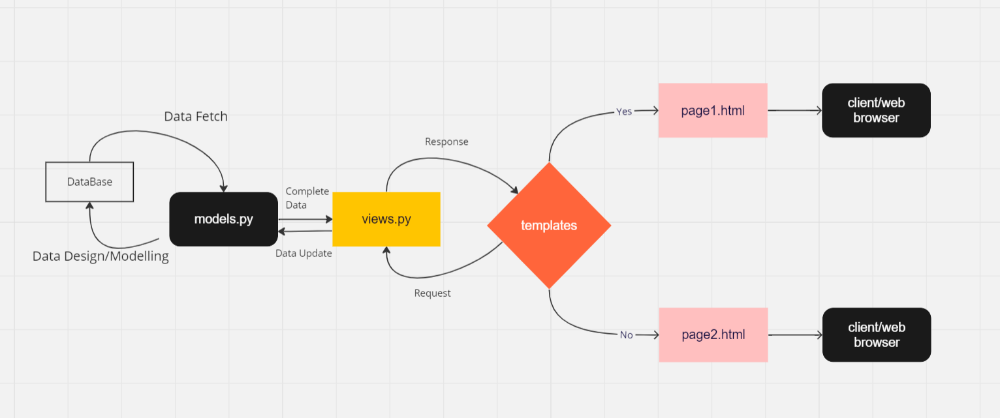

# Tugas2
 1. Alur mengimplementasikan checklist:
    a. Membuat directory baru bernama Tugas1 beserta repositori github
    b. Membuat project django baru dengan nama movie_list dengan command: django-admin startproject movie_list
    c. Membuat aplikasi bernama 'main' pada project tersebut dengan command: manage.py startapp main
    d. Menambahkan 'main' pada installed_apps di settings.py
    e. Membuat folder baru di dalam folder main dengan nama templates
    f. Menambahkan file main.html pada template 
    g. Membuat class baru pada models.py dengan nama 'Movie' dengan atribut berupa name, release_date, rating, dan likes
    h. Melakukan models migration 
    i. Membuat routing yang menghubungkan views dengan template html
    j. Menjalankan aplikasi dengan command: manage.py runserver
    k. Membuka halaman pada: http://127.0.0.1:8000/main/

2. Bagan dapat dilihat pada tautan berikut: 

3. Virtual environment adalah sebuah sistem yang dapat membuat pengguna melakukan interaksi terhadap lingkungan program maupun dengan pengguna lainnya. Sebuah aplikasi bisa saja dibuat tanpa VE, akan tetapi pengerjaannya tidak efisien.

4. 
    a. MVC atau Model-View-Controller adalah sebuah pola desain pada pengembangan sebuah aplikasi atau perangkat lunak yang terdiri dari bagian model, view, dan controller. Design Pattern ini digunakan pada beberapa framework seperti Laravel dan CodeIgniter. 
    b. MVT atau Model-View-Tempate juga merupakan pola desain yang mirip dengan MVC. Hanya saja perbedaannya adalah pada MVT, bagian controller sudah dihandle oleh framework sehingga programmer hanya perlu memperhatikan presentasi dari konten aplikasi yang disebut dengan template.MVT digunakan oleh framework seperti django.
    c. MVVP atau Model-View-ViewModel merupakan pola desain yang serupa dengan MVC hanya saja terdapat sebuah perubahan pada bagian controller yaitu pemisahan antara pengembangan front-end dan back-end. Framework yang menggunakan MVVC adalah Prism.

    Secara umum, perbedaan ketiga design pattern tersebut terdapat pada bagaimana cara menampilkan data pada view. Pada MVC, controller berfungsi sebagai jembatan antara model dan views yang berfungsi untuk menentukan bagaimana data yang di-fetch akan ditampilkan dengan basis logika yang sama. Sementara pada MVVC, basis logika yang digunakan pada server-side dan client-side berbeda. Sedangkan pada MVT view berfungsi sebagai tempat transit bagi data yang kemudian akan ditransfer ke halaman yang sudah ditentukan pada template untuk ditampilkan pada client.

# Tugas 3:
     
     1. Secara umum, perbedaan antara POST dan GET dapat terlihat pada URL. Dimana pada method GET, data akan terlihat pada URL dan sebaliknya pada method POST. Apabila ditinjau dari fungsionalitasnya secara khusus pada django, GET bersifat indempoten sementara POST tidak. Selain itu, dalam melakukan GET request di django tidak diperlukan validasi dan sebaliknya jika menggunakan POST.

     2. Perbedaan antara ketiganya terlihat pada purpose/tujuan pemakaian data delivery tersebut. Apabila seseorang menginginkan kemudahan pada prosesnya, maka gunakan JSON karena JSON memiliki struktur yang sederhana. Apabila menginginkan fleksibilitas, pilih XML. Dan apabila hendak menampilkan data tersebut pada client-side, maka harus menggunakan HTML untuk menampilkan data dengan format yang lebih presentatif.

     3. Aplikasi modern biasanya memiliki kompleksitas data yang tinggi sehingga dibutuhkan struktur data delivery yang sederhana seperti JSON.

     4. Untuk mengimplementasikan checklist diatas, saya membuatnya dengan mengikuti tutorial beserta beberapa sumber lainnya. Hal itu dikarenakan beberapa data yang saya miliki tidak sama strukturnya dengan yang di tutorial sehingga perlu memiliki atribut sendiri dan proses pengolahan sendiri.

# Tugas 4:

1. Django UserCreationForm merupakan salah satu modul autentikasi pada framework django yang berfungsi untuk membuat user baru yang dapat mengakses aplikasi dan terdaftar kedalam sistem admin aplikasi. Menurut saya, kelebihan dari UserCreationForm adalah kemudahan penggunaanya dan memiliki fungsionalitas yang terintegrasi. Akan tetapi, sistem build-in authentication dari module ini terlalu umum yang bahkan bisa diimplementasikan tanpa backend framework seperti menggunakan PHP saja, sehingga apabila menginginkan sistem otentikasi yang khusus, programmer harus mengimplementasikannya sendiri. Selain itu juga tampilan bawaan yang diberikan oleh modul ini sangat polos, sehingga diperlukan styling lebih lanjut di bagian front-end.

2. Autentikasi adalah proses pengidentifikasian tentang siapa pengguna yang akan login, apakah itu betul-betul pemilik akun atau orang lain. Otorisasi adalah proses verifikasi tentang apa yang bisa dilakukan dan diakses oleh seseorang berdasarkan rolenya dalam aplikasi tersebut. Keduanya penting karena autentikasi memastikan bahwa pengguna yang hendak memasuki sebuah akun benar-benar pemilik akun tersebut, otentikasi penting karena dalam aplikasi terdapat aturan dan batasan dari masing-masing user, seperti pengguna tidak bisa mengakses database, tetapi admin bisa mengakses dan memanipulasi database.

3. Cookies adalah sepotong data kecil yang disimpan oleh pengguna web di komputer atau perangkat mereka. Cookies digunakan dalam konteks aplikasi web untuk menyimpan informasi pada sisi klien (pengguna) dan mengirimkannya kembali ke server setiap kali permintaan dibuat. Ini memungkinkan server untuk mengidentifikasi pengguna yang berbeda dan menyimpan data sesi atau informasi lain yang diperlukan. Django menggunakan cookies dengan cara mengaktikan sessions -> mengonfigurasi database untuk menyimpan session -> menyimpan dan mengambil session di views -> Mengatur waktu kadaluarsa dari sebuah session.

4. Tidak, penggunaan cookies secara default tanpa security system yang mendukung sangat rentan akan threat XSS(Cross Site Scripting), sehingga dibutuhkan fitur keamanan lebih lanjut.

5. Cara saya mengimplementasikan checklist diatas adalah dengan mempelajari alur authentication dan sessions di slide PBP. Fitur registrasi , login, dan logout pertama-tama dibuat dengan merancang bagian front-end HTMLnya terlebih dahulu kemudian ditambahkan diintegrasikan dengan fungsi yang dibutuhkan sesuai dengan kebutuhan aplikasi saya. Untuk cookies dan session, diimplementasikan dengan cara yang sudah dijelaskan saat tutorial.

# Tugas 5:

1. Manfaat element selector di CSS adalah untuk memilih elemen-elemen tertentu dengan referensi berupa id atau class. Element selector digunakan apabila programmmer hendak melakukan styling terhadap satu atau lebih elemen pada HTML sehingga sesuai dengan UI design yang diinginkan. Cara paling efektif untuk menggunakan elemen selector adalah menamai elemen-elemen HTML yang akan memiliki desain yang sama dengan nama class yang sama sehingga dapat distyling secara bersamaan pada CSS.

2.Beberapa tag HTML5 dasar yang saya ketahui antara lain:
- Commen Tag : Tag untuk menambahkan komentar pada HTML seperti tag # pada python
- a: Merupakan sebuah hyperlink kepada referensi link/dokumen yang diberikan pada href dari tag tersebut
- br: Menambahkan break-line atau extra-space vertically
- div: Untuk membungkus beberapa komponen, biasanya berfungsi sebagai container dan harus dinamai class-nya jika ingin diedit pada CSS.
- button: Menambahkan elemen tombol
- body: Berisfat seperti div, yaitu sebagai pembungkus dari seluruh elemen yang berada pada inti website itu sendiri.
- footer: Berungsi sebagai pembungkus bagi catatan kaki pada website

3. Margin merupakan ruang/spasi kosong yang berada disekitar elemen, sementara padding merupakan ruang dalam/inner space yang dimiliki oleh suatu elemen.

4. Boostrap merupakan sebuah framework yang sudah memiliki fungsionalitas yang dibuat sehingga programmer tinggal mengimplementasikannya. Sementara tailwind memiliki fleksibilitas yang lebih luas untuk pemakaiannya. Boostrap sebaiknya digunakan apabila hendak membuat tampilan website yang konsisten. Tailwind lebih baik digunakan apabila ingin mengimplementaikan desain yang lebih kompleks seperti UI slicing.

5. Cara saya mengimplementasikan checklist diatas adalah dengan membuat cards dari template yang tersedia di google lalu memodelkannya sesuai dengan keinginan pribadi menggunakan boostrap. Setelah itu, fungsionalitas dari komponen-komponen yang sudah ada pada tugas 4 saya sesuaikan dengan komponen baru pada cards, seperti mengedit dan menghapus sebuah film. Untuk navbar sendiri, masih menggunakan bawaan dari boostrap.

# Tugas 6:
1. Dalam asynchronous programming, proses berjalannya program bisa dilakukan secara bersamaan tanpa menunggu proses antrian, hal inilah yang menyebabkan kita dapat melakukan proses seperti post dan get tanpa terjadi refresh sama sekali. Sebaliknya, synchronous programming merupakan bagian dari asynchronous programming  dimana proses akan dieksekusi secara bersamaan dan untuk hasil tergantung lama proses suatu fungsi synchronous.

2. Konsep event-driven programming pada AJAX mirip dengan event-driven programming pada Java, dimana konsep kerjanya tergantung dari kejadian atau event tertentu. Salah satu penerapannya pada tugas ini adalah ditampilkannya sebuah modal ketika mengklik button.

3. Asynchronous programming pada ajax dapat diterapkan dengan cara membuat XMLHttpRequest membuat callback function, XMLHttpRequest melakukan request ke server, server mengembalikan respon ke halaman web yang kemudian dibaca oleh javascript. Salah satu implementasinya adalah menggunakan fungsi fetch().

4. Fetch API merupakan sebuah metode yang lebih baru dan lebih fleksibel dikarenakan dapat digunakan dengan syntax native javascript, sementara Jquery adalah sebuah framework tersendiri dengan syntax dan semantic tersendiri.

5. Pada tugas ini, saya hanya berhasil mengimplementasikan get method karena terdapat kendali dengan penyesuaian tipe data yang tersimpan di database dan belum dapat menyelesaikannya hingga deadline.

